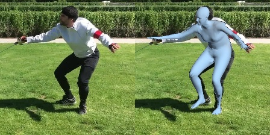
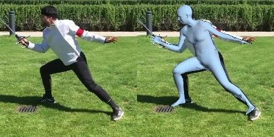
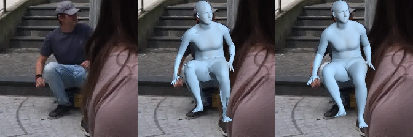
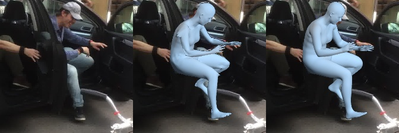
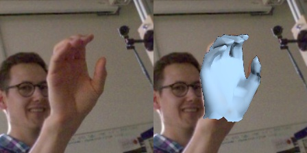
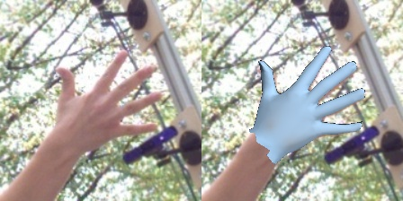

###### *Note: We follow the guideline provided by [MeshTransformer/docs/DEMO.md](https://github.com/microsoft/MeshTransformer/blob/main/docs/DEMO.md)*

# Demo 

We provide guidelines to run end-to-end inference on test images.

Our code iterates all images in the given folder, and produces estimation results.

- [3D Human Mesh Reconstruction](#demo_human)
- [3D Hand Mesh Reconstruction](#demo_hand)

---

<a name="demo_human"></a>

## 3D Human Mesh Reconstruction

This demo runs 3D human mesh reconstruction from a single RGB image. 

Our codes require the input images that are already **cropped with the person centered** in the image. The input images should have the size of `224x224`. To run the demo, please place your test images under `./demo/human-body`, and then run the following script. After running, it will generate the results in the folder `./demo/human-body`.

```bash
python ./src/tools/end2end_inference_bodymesh.py \
       --resume_checkpoint ./models/fastmetro_checkpoint/FastMETRO-L-H64_3dpw_state_dict.bin \
       --image_file_or_path ./demo/human-body 
```

- To use SMPL parameter regressor, you need to set `--use_smpl_param_regressor` as `True`

### Demo Result

- obtained by using the released model checkpoint (`FastMETRO-L-H64_3dpw_state_dict.bin`)





- obtained by using the released model checkpoint (`FastMETRO-L-H64_smpl_3dpw_state_dict.bin`)





- (Left) Input Image
- (Middle) FastMETRO
- (Right) FastMETRO with an optional SMPL parameter regressor


<a name="demo_hand"></a>

## 3D Hand Mesh Reconstruction

This demo runs 3D hand mesh reconstruction from a single RGB image. 

Our codes require the input images that are already **cropped with the right-hand centered** in the image. The input images should have the size of `224x224`. To run the demo, please place your test images under `./demo/hand`, and then run the following script. After running, it will generate the results in the folder `./demo/hand`.

*For the left-hand centered images, please horizontally flip the images before running this demo*

```bash
python ./src/tools/end2end_inference_handmesh.py \
       --resume_checkpoint ./models/fastmetro_checkpoint/FastMETRO-L-H64_freihand_state_dict.bin \
       --image_file_or_path ./demo/hand
```

### Demo Result

- obtained by using the released model checkpoint (`FastMETRO-L-H64_freihand_state_dict.bin`)




