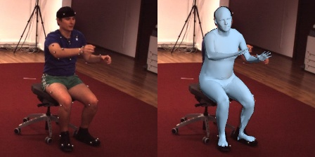
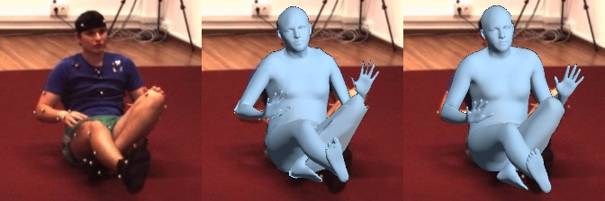
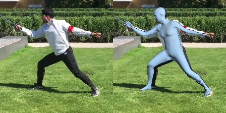
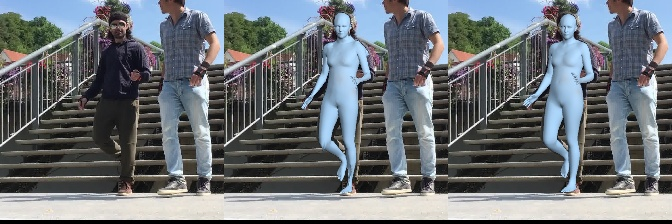
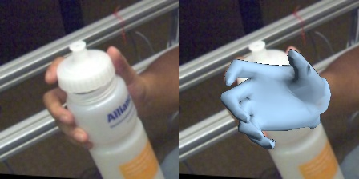

###### *Note: We follow the guideline provided by [MeshTransformer/docs/EXP.md](https://github.com/microsoft/MeshTransformer/blob/main/docs/EXP.md)*

# Training and Evaluation 

In our experiments, we conduct single-node distributed training using a machine with 4 V100 GPUs. 
- [3D Human Mesh Reconstruction (Human3.6M)](#h36m)
- [3D Human Mesh Reconstruction (3DPW)](#3dpw)
- [3D Hand Mesh Reconstruction (FreiHAND)](#freihand)

### Model Selection
- To use `FastMETRO-S-R50`, you need to set `--model_name` as `FastMETRO-S` and `--arch` as `resnet50`
- To use `FastMETRO-L-H64`, you need to set `--model_name` as `FastMETRO-L` and `--arch` as `hrnet-w64`

---

## 3D Human Mesh Reconstruction from a Single RGB Image

<a name="h36m"></a>

### Training on Human3.6M

We conduct large-scale training on multiple 2D and 3D datasets, including Human3.6M, COCO, MUCO, UP3D, MPII. During training, it will evaluate the performance per epoch, and save the best checkpoints.

```bash
python -m torch.distributed.launch --nproc_per_node=4 \
       src/tools/run_fastmetro_bodymesh.py \
       --train_yaml Tax-H36m-coco40k-Muco-UP-Mpii/train.yaml \
       --val_yaml human3.6m/valid.protocol2.yaml \
       --arch hrnet-w64 \
       --model_name FastMETRO-L \
       --num_workers 4 \
       --per_gpu_train_batch_size 16 \
       --per_gpu_eval_batch_size 16 \
       --lr 1e-4 \
       --num_train_epochs 60 \
       --output_dir FastMETRO-L-H64_h36m/
```

- To use SMPL parameter regressor, you need to set `--use_smpl_param_regressor` as `True` and load pre-trained FastMETRO
- To visualize the 3D mesh output during training, you need to set `--visualize_training` as `True`
- To use [OpenDR](https://github.com/mattloper/opendr) Renderer instead of [Pyrender](https://github.com/mmatl/pyrender) Renderer, you need to set `--use_opendr_renderer` as `True`

### Evaluation on Human3.6M

In the following script, we evaluate our model `FastMETRO-L-H64_h36m_state_dict.bin` on Human3.6M validation set. Check `docs/Download.md` for more details about downloading the model file.

```bash
python -m torch.distributed.launch --nproc_per_node=4 \
       src/tools/run_fastmetro_bodymesh.py \
       --val_yaml human3.6m/valid.protocol2.yaml \
       --arch hrnet-w64 \
       --model_name FastMETRO-L \
       --num_workers 4 \
       --per_gpu_eval_batch_size 16 \
       --run_evaluation \
       --resume_checkpoint ./models/fastmetro_checkpoint/FastMETRO-L-H64_h36m_state_dict.bin \
       --output_dir FastMETRO-L-H64_h36m_eval/
```

- To use SMPL parameter regressor, you need to set `--use_smpl_param_regressor` as `True`
- To visualize the 3D mesh output during evaluation, you need to set `--run_eval_and_visualize` as `True`
- To visualize the 3D mesh output in multi views, you need to set `--visualize_multi_view` as `True`
- To use [OpenDR](https://github.com/mattloper/opendr) Renderer instead of [Pyrender](https://github.com/mmatl/pyrender) Renderer, you need to set `--use_opendr_renderer` as `True`

#### Quantitative Evaluation Result ([Evaluation Log](https://drive.google.com/u/2/uc?id=1L-1O6STcwTQPolv8U2e9j6MoIQh4vTof&export=download&confirm=t))

- obtained by using the released model checkpoint (`FastMETRO-L-H64_h36m_state_dict.bin`)

```
MPJPE:  52.96, PA-MPJPE:  33.58 
```

#### Qualitative Evaluation Result

- obtained by using the released model checkpoint (`FastMETRO-L-H64_h36m_state_dict.bin`)



- obtained by using the released model checkpoint (`FastMETRO-L-H64_smpl_h36m_state_dict.bin`)



- (Left) Input Image
- (Middle) FastMETRO
- (Right) FastMETRO with an optional SMPL parameter regressor


<a name="3dpw"></a>

### Training on 3DPW

We follow prior works that also use 3DPW training data. In order to make the training faster, we **fine-tune** our pre-trained model (`FastMETRO-L-H64_h36m_state_dict.bin`) on 3DPW training set. 

We use the following script for fine-tuning. During fine-tuning, it will evaluate the performance per epoch, and save the best checkpoints. 

```bash
python -m torch.distributed.launch --nproc_per_node=4 \
       src/tools/run_fastmetro_bodymesh.py \
       --train_yaml 3dpw/train.yaml \
       --val_yaml 3dpw/test_has_gender.yaml \
       --arch hrnet-w64 \
       --model_name FastMETRO-L \
       --num_workers 4 \
       --per_gpu_train_batch_size 16 \
       --per_gpu_eval_batch_size 16 \
       --lr 2e-5 \
       --num_train_epochs 8 \
       --resume_checkpoint ./models/fastmetro_checkpoint/FastMETRO-L-H64_h36m_state_dict.bin \
       --output_dir FastMETRO-L-H64_3dpw/
```

- To use SMPL parameter regressor, you need to set `--use_smpl_param_regressor` as `True` and load pre-trained FastMETRO
- To visualize the 3D mesh output during training, you need to set `--visualize_training` as `True`
- To use [OpenDR](https://github.com/mattloper/opendr) Renderer instead of [Pyrender](https://github.com/mmatl/pyrender) Renderer, you need to set `--use_opendr_renderer` as `True`


### Evaluation on 3DPW
In the following script, we evaluate our model `FastMETRO-L-H64_3dpw_state_dict.bin` on 3DPW test set. Check `docs/Download.md` for more details about downloading the model file.

```bash
python -m torch.distributed.launch --nproc_per_node=4 \
       src/tools/run_fastmetro_bodymesh.py \
       --val_yaml 3dpw/test_has_gender.yaml \
       --arch hrnet-w64 \
       --model_name FastMETRO-L \
       --num_workers 4 \
       --per_gpu_eval_batch_size 16 \
       --run_evaluation \
       --resume_checkpoint ./models/fastmetro_checkpoint/FastMETRO-L-H64_3dpw_state_dict.bin \
       --output_dir FastMETRO-L-H64_3dpw_eval/
```

- To use SMPL parameter regressor, you need to set `--use_smpl_param_regressor` as `True`
- To visualize the 3D mesh output during evaluation, you need to set `--run_eval_and_visualize` as `True`
- To visualize the 3D mesh output in multi views, you need to set `--visualize_multi_view` as `True`
- To use [OpenDR](https://github.com/mattloper/opendr) Renderer instead of [Pyrender](https://github.com/mmatl/pyrender) Renderer, you need to set `--use_opendr_renderer` as `True`

#### Quantitative Evaluation Result ([Evaluation Log](https://drive.google.com/u/2/uc?id=1PjyXmfevsxs4FO7K4fmjYzfJCMbKrsJK&export=download&confirm=t))

- obtained by using the released model checkpoint (`FastMETRO-L-H64_3dpw_state_dict.bin`)

```
MPVPE:  82.95, MPJPE:  73.54, PA-MPJPE:  44.58 
```

#### Qualitative Evaluation Result

- obtained by using the released model checkpoint (`FastMETRO-L-H64_3dpw_state_dict.bin`)



- obtained by using the released model checkpoint (`FastMETRO-L-H64_smpl_3dpw_state_dict.bin`)



- (Left) Input Image
- (Middle) FastMETRO
- (Right) FastMETRO with an optional SMPL parameter regressor


## 3D Hand Mesh Reconstruction from a Single RGB Image

<a name="freihand"></a>

### Training on FreiHAND

We use the following script to train on FreiHAND dataset. 

```bash
python -m torch.distributed.launch --nproc_per_node=4 \
       src/tools/run_fastmetro_handmesh.py \
       --train_yaml freihand/train.yaml \
       --val_yaml freihand/test.yaml \
       --arch hrnet-w64 \
       --model_name FastMETRO-L \
       --num_workers 4 \
       --per_gpu_train_batch_size 16 \
       --per_gpu_eval_batch_size 16 \
       --lr 1e-4 \
       --num_train_epochs 200 \
       --output_dir FastMETRO-L-H64_freihand/
```

- To visualize the 3D mesh output during training, you need to set `--visualize_training` as `True`
- To use [OpenDR](https://github.com/mattloper/opendr) Renderer instead of [Pyrender](https://github.com/mmatl/pyrender) Renderer, you need to set `--use_opendr_renderer` as `True`

### Evaluation on FreiHAND

In the following script, we evaluate our model `FastMETRO-L-H64_freihand_state_dict.bin` on FreiHAND test set. This will generate prediction results.

```bash
python src/tools/run_fastmetro_handmesh.py \
       --val_yaml freihand/test.yaml \
       --arch hrnet-w64 \
       --model_name FastMETRO-L \
       --num_workers 4 \
       --per_gpu_eval_batch_size 16 \
       --run_evaluation \
       --resume_checkpoint ./models/fastmetro_checkpoint/FastMETRO-L-H64_freihand_state_dict.bin \
       --output_dir FastMETRO-L-H64_freihand_eval/
```

- To visualize the 3D mesh output during evaluation, you need to set `--run_eval_and_visualize` as `True`
- To visualize the 3D mesh output in multi views, you need to set `--visualize_multi_view` as `True`
- To use [OpenDR](https://github.com/mattloper/opendr) Renderer instead of [Pyrender](https://github.com/mmatl/pyrender) Renderer, you need to set `--use_opendr_renderer` as `True`

There are two ways to evaluate the prediction results:

(1) Submit the results to [FreiHAND Leaderboard](https://competitions.codalab.org/competitions/21238) and obtain the evaluation scores 

(2) Download the annotations for evaluation from [FreiHAND Dataset Page](https://lmb.informatik.uni-freiburg.de/resources/datasets/FreihandDataset.en.html) and use [FreiHAND Evaluation Code](https://github.com/lmb-freiburg/freihand) to obtain the evaluation scores 

#### Quantitative Evaluation Result

- obtained by using the released model checkpoint (`FastMETRO-L-H64_freihand_state_dict.bin`)

```
Evaluation 3D KP results:
auc=0.000, mean_kp3d_avg=71.50 cm
Evaluation 3D KP ALIGNED results:
auc=0.871, mean_kp3d_avg=0.65 cm

Evaluation 3D MESH results:
auc=0.000, mean_kp3d_avg=71.50 cm
Evaluation 3D MESH ALIGNED results:
auc=0.858, mean_kp3d_avg=0.71 cm

F-scores
F@5.0mm = 0.000         F_aligned@5.0mm = 0.687
F@15.0mm = 0.000        F_aligned@15.0mm = 0.983
```

- Note that only the aligned scores are considered because FastMETRO predicts relative coordinates, as in [METRO](https://github.com/microsoft/MeshTransformer) and [Mesh Graphormer](https://github.com/microsoft/MeshGraphormer).
- There was no test-time augmentation.

#### Qualitative Evaluation Result

- obtained by using the released model checkpoint (`FastMETRO-L-H64_freihand_state_dict.bin`)

